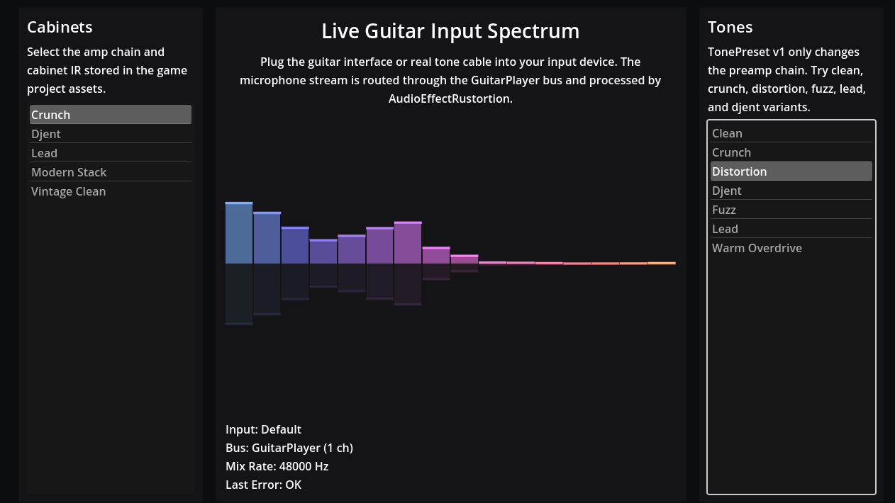

# AudioEffectRustortion (Godot Addon)

`AudioEffectRustortion` is a Godot 4.5 GDExtension audio effect written in Rust.

It is designed for guitar-style real-time processing with a simple data-driven API:
- the game loads preset JSON and IR WAV bytes
- the addon receives parsed tone/amp JSON strings and IR byte buffers
- processing runs in Rust on the audio thread

## What it does

- Applies tone preamp chains (`TonePresetV1` JSON)
- Applies amplifier chains and input filters (`AmplifierPresetV1` JSON)
- Applies cabinet impulse responses from WAV bytes
- Crossfades runtime config updates to avoid preset-switch clicks

## Project layout

- `src/` — Godot extension implementation
- `rustortion-core` — git dependency from `https://github.com/goguitar/rustortion` (branch `main`)
- `godot-rustortion-demo/` — demo project using live input and preset lists

## Development

`rustortion-core` is fetched automatically by Cargo from GitHub on build.

Build release library and copy it into the demo project:

```bash
cargo build --release
cp target/release/libgodot_rustortion.so godot-rustortion-demo/addons/godot_rustortion/bin/libgodot_rustortion.so
```

Demo binaries are not committed; rebuild/copy as part of local testing.

Run a headless demo bus-output smoke test:

```bash
godot --headless --path godot-rustortion-demo --script res://demo_test.gd
```

## Demo


